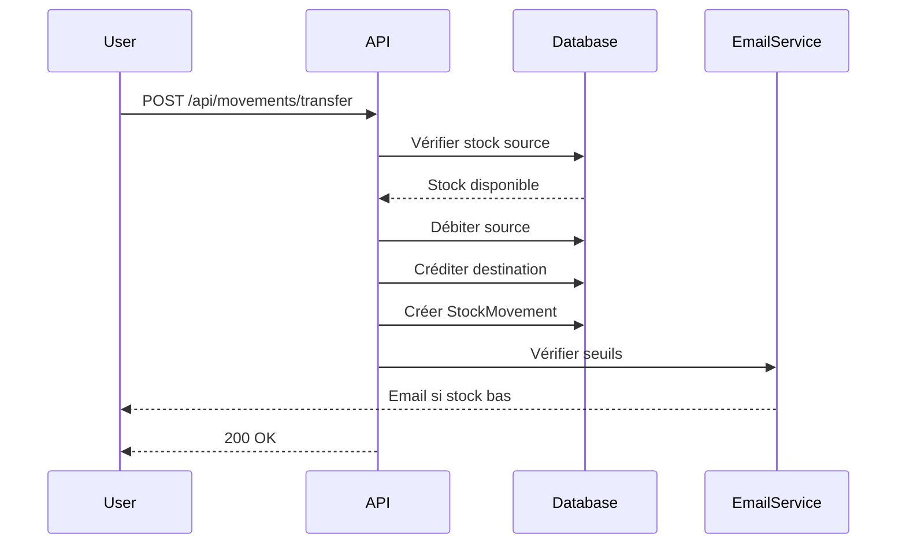

# 📦 Multi-Tenant Inventory Manager (SaaS)

Une solution de gestion de stock multi-entreprise robuste permettant de gérer les flux de marchandises entre usines, entrepôts et points de vente en temps réel.


## 🚀 Fonctionnalités Clés

- **Multi-tenancy (Isolation de données)** : Chaque entreprise accède uniquement à ses propres données via un identifiant d'organisation unique.
- **Gestion Multi-Entrepôts** : Suivi précis des stocks dans les usines, entrepôts centraux et petites boutiques.
- **Mouvements de Stock** : Historisation complète des entrées, sorties et transferts inter-sites.
- **Système d'Alertes Intelligent** :
  - Détection automatique des stocks bas par entrepôt.
  - Notifications Email automatiques envoyées directement au gestionnaire de l'entrepôt concerné.
- **Tableau de Bord Temps Réel** : Visualisation des flux et des niveaux de stock critiques.

## 🛠 Stack Technique

| Couche | Technologies |
|--------|-------------|
| **Frontend** | React 18, TypeScript, Tailwind CSS, TanStack Query (React Query) |
| **Backend** | Node.js, Express, TypeScript |
| **Base de données** | MongoDB avec Mongoose (Architecture multi-tenant) |
| **Communications** | Nodemailer (Emails), JWT (Authentification) |

## 📂 Structure du Projet

```
├── apps/
│   ├── backend/                # API Node.js/TypeScript
│   │   ├── src/
│   │   │   ├── models/         # Schémas Mongoose (Stock, Movement, User...)
│   │   │   ├── controllers/    # Logique métier et mouvements
│   │   │   ├── services/       # Service d'envoi d'emails & calculs
│   │   │   ├── routes/         # Définition des routes API
│   │   │   └── middlewares/    # Isolation par organizationId
│   └── frontend/               # Application React
│       ├── src/
│       │   ├── components/     # UI reusable (Shadcn/UI)
│       │   ├── hooks/          # Custom hooks pour les stocks
│       │   ├── pages/          # Dashboard, Inventaire, Transferts
│       │   └── services/       # API client et utilitaires
```

## ⚙️ Installation

### Prérequis

- **Node.js** (v18+)
- **MongoDB** (Local ou Atlas)
- **Un compte SMTP** (Gmail, SendGrid ou Mailtrap pour les tests)

### 1. Cloner le projet

```bash
git clone https://github.com/votre-username/inventory-manager.git
cd inventory-manager
```

### 2. Configuration Backend

Créez un fichier `.env` dans le dossier `apps/backend` :

```env
PORT=5000
MONGO_URI=mongodb://localhost:27017/inventory_db
JWT_SECRET=votre_secret_super_secure
JWT_EXPIRES_IN=7d

# Configuration SMTP
SMTP_HOST=smtp.mailtrap.io
SMTP_PORT=587
SMTP_USER=votre_user
SMTP_PASS=votre_pass
SMTP_FROM=noreply@inventory-manager.com
```

### 3. Configuration Frontend

Créez un fichier `.env` dans le dossier `apps/frontend` :

```env
VITE_API_URL=http://localhost:5000/api
```

### 4. Lancer l'application (Mode Dev)

```bash
# Installation des dépendances (depuis la racine)
npm install

# Lancer le backend
cd apps/backend
npm install
npm run dev

# Lancer le frontend (dans un autre terminal)
cd apps/frontend
npm install
npm run dev
```

L'application sera accessible sur :
- **Frontend** : http://localhost:5173
- **Backend API** : http://localhost:5000

## 📋 Flux de Mouvement de Stock (Exemple)

Lorsqu'un transfert est initié :

1. **Validation** : Vérification de la disponibilité du stock dans l'entrepôt source.
2. **Transaction** : Débit de la source, crédit de la destination.
3. **Audit** : Création d'un `StockMovement` immuable.
4. **Alerte** : Si le stock destination < `minThreshold`, un email est envoyé au Manager de cet entrepôt.



## 🔌 API Endpoints

### Authentification

| Méthode | Endpoint | Description |
|---------|----------|-------------|
| POST | `/api/auth/register` | Inscription d'une nouvelle organisation |
| POST | `/api/auth/login` | Connexion utilisateur |
| GET | `/api/auth/me` | Profil utilisateur courant |

### Entrepôts

| Méthode | Endpoint | Description |
|---------|----------|-------------|
| GET | `/api/warehouses` | Liste des entrepôts |
| POST | `/api/warehouses` | Créer un entrepôt |
| GET | `/api/warehouses/:id` | Détails d'un entrepôt |
| PUT | `/api/warehouses/:id` | Modifier un entrepôt |
| DELETE | `/api/warehouses/:id` | Supprimer un entrepôt |

### Produits

| Méthode | Endpoint | Description |
|---------|----------|-------------|
| GET | `/api/products` | Liste des produits |
| POST | `/api/products` | Créer un produit |
| GET | `/api/products/:id` | Détails d'un produit |
| PUT | `/api/products/:id` | Modifier un produit |
| DELETE | `/api/products/:id` | Supprimer un produit |

### Stocks

| Méthode | Endpoint | Description |
|---------|----------|-------------|
| GET | `/api/stocks` | Liste des stocks |
| GET | `/api/stocks/warehouse/:id` | Stocks par entrepôt |
| GET | `/api/stocks/alerts` | Stocks en alerte |

### Mouvements

| Méthode | Endpoint | Description |
|---------|----------|-------------|
| GET | `/api/movements` | Historique des mouvements |
| POST | `/api/movements/entry` | Entrée de stock |
| POST | `/api/movements/exit` | Sortie de stock |
| POST | `/api/movements/transfer` | Transfert inter-entrepôts |

## 🛣 Roadmap

- [ ] Génération de rapports PDF (Bons de livraison)
- [ ] Lecture de codes-barres via la caméra mobile
- [ ] Support multilingue (i18n)
- [ ] Module de gestion des abonnements (SaaS Payant)
- [ ] Intégration avec des ERP externes
- [ ] Application mobile React Native

## 🧪 Tests

```bash
# Backend tests
cd apps/backend
npm run test

# Frontend tests
cd apps/frontend
npm run test
```

## 🤝 Contribution

Les contributions sont les bienvenues ! Veuillez suivre ces étapes :

1. Fork le projet
2. Créez votre branche (`git checkout -b feature/AmazingFeature`)
3. Committez vos changements (`git commit -m 'Add some AmazingFeature'`)
4. Push vers la branche (`git push origin feature/AmazingFeature`)
5. Ouvrez une Pull Request

## 📄 Licence

Distribué sous la licence MIT. Voir `LICENSE` pour plus d'informations.

## 📧 Contact

Pour toute question ou suggestion, n'hésitez pas à ouvrir une issue sur GitHub.

---

**Fait avec ❤️ pour simplifier la gestion de stock**
